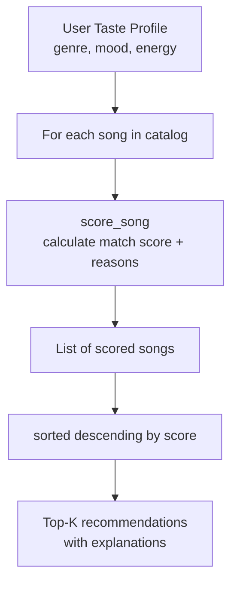

# Music Recommender Simulation

## Project Summary

This project builds a simple content-based music recommender from scratch. Given a user's taste profile — their preferred genre, mood, and energy level — the system scores every song in a 24-song catalog and returns the top matches with a plain-English explanation for each result. The goal is to make the "black box" of recommendation visible, so you can see exactly why a song ends up at #1 or gets buried at #20.

---

## How The System Works

### Real-world recommendation systems

Services like Spotify and YouTube use two main approaches under the hood.

**Collaborative filtering** is the "people like you" method — it looks at the listening history of thousands of users and says "the people who enjoyed what you enjoy also loved this track." It doesn't need to know anything about the song's actual sound; it just uses crowd behavior as a proxy for taste.

**Content-based filtering** is the "this song sounds like what you like" method — it compares measurable attributes of the songs (tempo, energy, mood, genre) directly against your stated preferences. This is what this project implements, because it's much easier to reason about and explain.

Real platforms combine both. This simulation uses only content-based filtering, which makes it transparent but also limited — it can't learn from what users actually play or skip.

### Features used

Each `Song` in the catalog has these attributes:
- `genre` — broad musical category (pop, rock, jazz, etc.)
- `mood` — emotional tone (happy, chill, intense, etc.)
- `energy` — 0.0 (very quiet/calm) to 1.0 (very loud/intense)
- `tempo_bpm` — beats per minute
- `valence` — how "positive" the song sounds (0.0–1.0)
- `danceability` — how rhythm-driven and danceable (0.0–1.0)
- `acousticness` — how acoustic (not electronic) the sound is (0.0–1.0)

A `UserProfile` stores:
- `genre` — favorite genre
- `mood` — preferred mood
- `energy` — target energy level
- `likes_acoustic` — whether the user gravitates toward acoustic sounds
- `target_valence` (optional) — target emotional positivity level

### Algorithm Recipe

| Scoring Rule | Points Awarded |
|---|---|
| Genre matches user's preference | **+2.0** |
| Mood matches user's preference | **+1.0** |
| Energy proximity: `1.0 - |song_energy - target_energy|` | **0.0 to 1.0** |
| Acousticness bonus (only if `likes_acoustic=True`): `acousticness x 0.5` | **0.0 to 0.5** |
| Valence match (optional): `(1.0 - |song_valence - target_valence|) x 0.5` | **0.0 to 0.5** |

Genre gets the most weight because it's the broadest signal — a folk listener and a death-metal fan are unlikely to agree even if their energy targets match exactly. Mood is next because two songs in the same genre can still feel completely different. Energy proximity is continuous — a near-perfect energy match earns close to a full point.

### Ranking rule

Once every song has a score, the list is sorted highest to lowest and the top-K songs are returned. `sorted()` is used instead of `.sort()` so the original catalog list is never modified — that way you can run the same song list through multiple different user profiles without side effects.

### Data flow (Mermaid)



---

## Getting Started

### Setup
```bash
python3 -m venv .venv
source .venv/bin/activate   # Mac/Linux
pip install -r requirements.txt
```

### Run
```bash
python3 -m src.main
```

### Tests
```bash
pytest
```

---

## Experiments

### Experiment 1 — Genre weight anchors results
**Profile: High-Energy Pop** (genre=pop, mood=happy, energy=0.85)

"Sunrise City" hit #1 with a score of 3.97 — genre, mood, and energy all matched. "Gym Hero" (pop/intense, energy=0.93) came in #2 with 2.92 despite the mood miss, because genre alone is worth 2 points. This confirmed that genre weight is load-bearing: even a perfect energy match in the wrong genre can't compete with a genre hit.

### Experiment 2 — Weight shift experiment
Temporarily doubled the energy weight (multiplier from 1.0x to 2.0x) and halved genre weight to 1.0. The Chill Lofi profile then ranked "Acoustic Confession" (folk/sad, energy=0.25) above "Focus Flow" (lofi/focused), purely on energy proximity. This showed that genre weight of 2.0 is necessary to keep results genre-coherent.

### Experiment 3 — Adversarial/conflicting profile
**Profile:** `genre="ambient", mood="chill", energy=0.9, likes_acoustic=True`

This is a contradiction: the user wants calm, acoustic, ambient music but also wants high energy. The system surfaced "Iron Sky" (metal, intense, energy=0.96) at #3 — the math doesn't know that "high-energy" and "chill" are contradictory.

---

## Limitations and Risks
- Small catalog (24 songs) means genre diversity is quickly exhausted — rock only has 2 songs.
- Genre filter bubble: a pop user will rarely see jazz or folk in their top 5.
- Unused features: `danceability` and `tempo_bpm` are loaded but not scored.
- No feedback loop: the system learns nothing from what users actually like or skip.
- Static preferences: real users shift mood by time of day or season; this system has no concept of context.

---

## Terminal Output Screenshots

### High-Energy Pop
```
============================================================
  Profile : High-Energy Pop
  Prefs   : genre=pop, mood=happy, energy=0.85
============================================================
  #1  Sunrise City  —  Neon Echo
       Score  : 4.39
       Why    : genre match (+2.0); mood match (+1.0); energy similarity +0.97; valence match +0.50

  #2  Gym Hero  —  Max Pulse
       Score  : 3.34
       Why    : genre match (+2.0); energy similarity +0.92; valence match +0.46

  #3  Block Party Anthem  —  Kilo Verse
       Score  : 2.28
       Why    : mood match (+1.0); energy similarity +0.95; valence match +0.49

  #4  Rooftop Lights  —  Indigo Parade
       Score  : 2.23
       Why    : mood match (+1.0); energy similarity +0.91; valence match +0.48

  #5  Golden Hour Soul  —  Velvet James
       Score  : 2.15
       Why    : mood match (+1.0); energy similarity +0.83; valence match +0.49
```

### Chill Lofi Study
```
============================================================
  Profile : Chill Lofi Study
  Prefs   : genre=lofi, mood=chill, energy=0.38
============================================================
  #1  Library Rain  —  Paper Lanterns
       Score  : 4.90
       Why    : genre match (+2.0); mood match (+1.0); energy similarity +0.97; acousticness bonus +0.43; valence match +0.49

  #2  Midnight Coding  —  LoRoom
       Score  : 4.77
       Why    : genre match (+2.0); mood match (+1.0); energy similarity +0.96; acousticness bonus +0.35; valence match +0.49

  #3  Focus Flow  —  LoRoom
       Score  : 3.89
       Why    : genre match (+2.0); energy similarity +0.98; acousticness bonus +0.39; valence match +0.45

  #4  Mountain Trail Song  —  Cedar Folk
       Score  : 2.96
       Why    : mood match (+1.0); energy similarity +0.95; acousticness bonus +0.44; valence match +0.42

  #5  Spacewalk Thoughts  —  Orbit Bloom
       Score  : 2.90
       Why    : mood match (+1.0); energy similarity +0.90; acousticness bonus +0.46; valence match +0.47
```

### Deep Intense Rock
```
============================================================
  Profile : Deep Intense Rock
  Prefs   : genre=rock, mood=intense, energy=0.92
============================================================
  #1  Storm Runner  —  Voltline
       Score  : 4.38
       Why    : genre match (+2.0); mood match (+1.0); energy similarity +0.99; valence match +0.52

  #2  Solar Flare  —  Voltline
       Score  : 4.23
       Why    : genre match (+2.0); mood match (+1.0); energy similarity +0.96; valence match +0.52

  #3  Gym Hero  —  Max Pulse
       Score  : 2.32
       Why    : mood match (+1.0); energy similarity +0.99; valence match +0.34

  #4  Drop It Low  —  Circuit Breaker
       Score  : 2.05
       Why    : mood match (+1.0); energy similarity +0.97; valence match +0.42

  #5  Iron Sky  —  The Forge
       Score  : 1.88
       Why    : mood match (+1.0); energy similarity +0.96; valence match +0.42
```

### Late-Night Jazz
```
============================================================
  Profile : Late-Night Jazz
  Prefs   : genre=jazz, mood=moody, energy=0.32
============================================================
  #1  Jazz in the Rain  —  Slow Stereo
       Score  : 4.90
       Why    : genre match (+2.0); mood match (+1.0); energy similarity +0.99; acousticness bonus +0.41; valence match +0.50

  #2  Coffee Shop Stories  —  Slow Stereo
       Score  : 3.88
       Why    : genre match (+2.0); energy similarity +0.95; acousticness bonus +0.45; valence match +0.42

  #3  Neon Carousel  —  Dreamwave
       Score  : 2.09
       Why    : mood match (+1.0); energy similarity +0.62; acousticness bonus +0.10; valence match +0.48

  #4  Night Drive Loop  —  Neon Echo
       Score  : 2.00
       Why    : mood match (+1.0); energy similarity +0.57; acousticness bonus +0.11; valence match +0.47

  #5  Mountain Trail Song  —  Cedar Folk
       Score  : 1.80
       Why    : energy similarity +0.99; acousticness bonus +0.44; valence match +0.47
```

### Hip-Hop Workout
```
============================================================
  Profile : Hip-Hop Workout
  Prefs   : genre=hip-hop, mood=focused, energy=0.80
============================================================
  #1  Pulse Check  —  Metro Grid
       Score  : 4.31
       Why    : genre match (+2.0); mood match (+1.0); energy similarity +0.97; valence match +0.44

  #2  Block Party Anthem  —  Kilo Verse
       Score  : 3.28
       Why    : genre match (+2.0); energy similarity +0.96; valence match +0.44

  #3  Focus Flow  —  LoRoom
       Score  : 1.87
       Why    : mood match (+1.0); energy similarity +0.60; valence match +0.46

  #4  Rooftop Lights  —  Indigo Parade
       Score  : 1.45
       Why    : energy similarity +0.96; valence match +0.49

  #5  Golden Hour Soul  —  Velvet James
       Score  : 1.42
       Why    : energy similarity +0.88; valence match +0.44
```

---

## Reflection
See [model_card.md](model_card.md) for the full model card and personal reflection.
